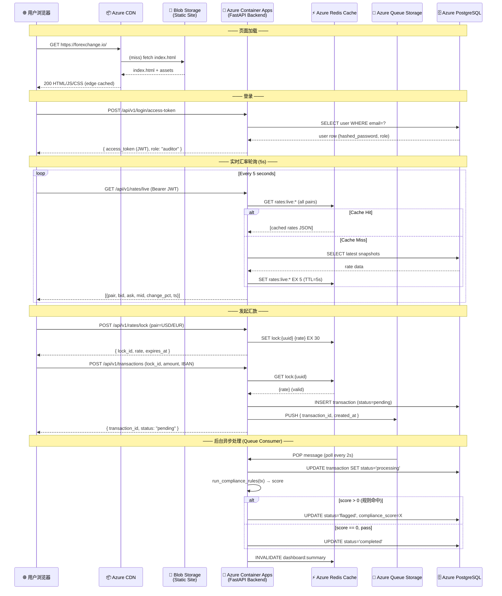
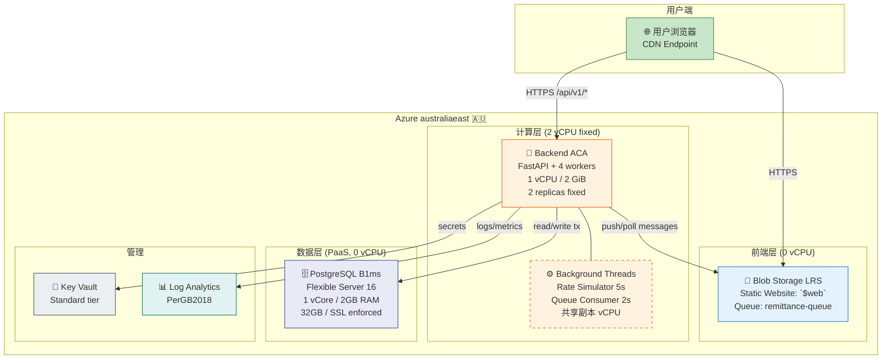
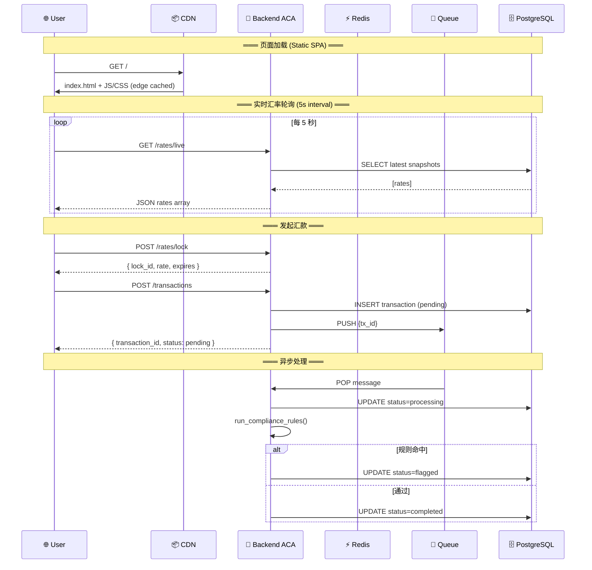
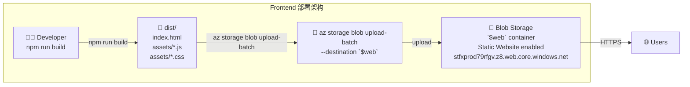

# ForeXchange — Azure Cloud Architecture Design Document

> **Date**: 2026-06-08
> **Project**: ForeXchange — Real-Time Remittance & Compliance Monitoring Platform
> **Cloud Platform**: Microsoft Azure
> **Subscription**: Azure for Students (Subscription ID: `00000000-0000-0000-0000-000000000000`)
> **Region**: `australiaeast`
> **Quota**: Total Regional vCPUs = 6 (student subscription hard limit)
> **IaC**: Terraform one-click deployment
> **Image Registry**: Docker Hub (`<private-registry>/forexchange-backend`)

---

## 0. Subscription Constraints

### 0.1 Azure for Students Measured Data

| Item | Value |
|------|-------|
| Subscription Name | Azure for Students |
| Subscription ID | `00000000-0000-0000-0000-000000000000` |
| Tenant ID | `96e2f052-4512-4d4c-b2c0-cd0d36ad6437` |
| User | `569144003@qq.com` |
| Region | `australiaeast` ✅ |
| Credit | $100 USD |
| Deployed Resources | `NetworkWatcherRG` (australiaeast) |

### 0.2 vCPU Quota (Critical Constraint)

```
Total Regional vCPUs:  6  ← Hard limit!
  ├── Dv3/Dv4/DSv3/DSv4 Family: 4 vCPUs each (max 4 usable per family)
  ├── BS Family:                 4 vCPUs (burst)
  ├── Basv2/Bsv2 Family:        10 vCPUs (better burst)
  ├── Ev3/Ev4 Family:            4 vCPUs
  ├── F Family:                  4 vCPUs
  └── NC Family:                 6 vCPUs (GPU, not needed)

Current usage: 0 / 6 vCPUs ✅ All available
```

### 0.3 Registered Azure Providers

| Provider | Status | Purpose |
|----------|--------|---------|
| `Microsoft.App` | ✅ Registered | Container Apps |
| `Microsoft.Cache` | ✅ Registered | Redis Cache (retired, unused) |
| `Microsoft.DBforPostgreSQL` | ✅ Registered | PostgreSQL Flexible Server |
| `Microsoft.Cdn` | ✅ Registered | CDN |
| `Microsoft.Storage` | ✅ Registered | Blob + Queue Storage |
| `Microsoft.KeyVault` | ✅ Registered | Secrets Management |

---

## 1. Architecture Overview

### 1.1 Design Principles

| Principle | Description |
|-----------|-------------|
| **Static Separation** | Frontend SPA hosted on Azure Blob Static Website, zero server-side rendering |
| **Read-Write Separation** | Real-time rates read directly from PostgreSQL; transactions go through ACID-compliant PostgreSQL |
| **Async Decoupling** | Remittance requests processed asynchronously via Azure Queue |
| **Stateless Compute** | Backend ACA stateless, 2 fixed replicas |
| **HTTPS Everywhere** | Blob static site HTTPS, ACA auto TLS, PostgreSQL enforced SSL |
| **One-Click Deploy** | Terraform full-stack IaC, single `terraform apply` to deploy all resources |

### 1.2 Architecture Diagram

```
  User Browser
       |
   Azure Front Door / CDN (optional)
       |
   Azure Blob Static Website (Frontend SPA)
       |
   Azure Container Apps (Backend API, 2 replicas)
       |
   +----+----+
   |         |
PostgreSQL  Azure Queue Storage
(16 vCore)  (Async remittance)
```

### 1.3 Component Relationships

| Component | Technology | Purpose |
|-----------|-----------|---------|
| Frontend Hosting | Azure Blob Storage Static Website | Serves React SPA build output |
| Backend API | Azure Container Apps (FastAPI) | REST API with JWT auth |
| Database | Azure PostgreSQL Flexible Server | Primary data store |
| Async Queue | Azure Queue Storage | Processes remittance asynchronously |
| Secrets | Azure Key Vault | Stores DB passwords, JWT secrets, API keys |
| CI/CD | GitHub Actions → Docker Hub → ACA | Automated build and deploy |

---

## 2. Data Flow & Request Routing

### 2.1 Normal Request Flow

```
User → Blob Static Website (HTTPS) → ACA Backend → PostgreSQL
                                              → Key Vault (secrets)
```

### 2.2 Remittance Flow (Async)

```
User → ACA Backend → Queue Storage → ACA Worker → PostgreSQL
```

### 2.3 Rate Polling Flow

```
ACA Rate Generator (5s interval) → Frankfurter API (ECB) → PostgreSQL
```

---

## 3. Component Details

### 3.1 Frontend Hosting — Azure Blob Static Website

| Feature | Configuration |
|---------|--------------|
| Hosting | `$web` container in Storage Account |
| Custom Domain | Configure via Azure CDN |
| HTTPS | Enabled by default |
| Fallback | 404 → `index.html` for SPA routing |
| Cache | CDN caching with versioned build assets |

### 3.2 Backend API — Azure Container Apps

| Feature | Configuration |
|---------|--------------|
| Runtime | Python 3.10+ (FastAPI on uvicorn) |
| Replicas | 2 (fixed, not auto-scaling) |
| CPU | 0.5 vCPU per replica |
| Memory | 1 GiB per replica |
| Ingress | External HTTPS on port 80 |
| Health Probe | `GET /api/v1/utils/health-check/` |
| Environment | via Key Vault references + direct env vars |

### 3.3 Database — Azure PostgreSQL Flexible Server

| Feature | Configuration |
|---------|--------------|
| SKU | Standard_D2ds_v4 (2 vCPU, 8 GiB) |
| Storage | 32 GiB (minimum) |
| Backup | Geo-redundant backup (7-day retention) |
| SSL | Enforced |
| Firewall | Azure services only + ACA outbound IPs |

### 3.4 Secrets — Azure Key Vault

| Secret Name | Purpose |
|-------------|---------|
| `postgres-password` | PostgreSQL admin password |
| `secret-key` | JWT signing secret |
| `sentry-dsn` | Sentry error monitoring DSN |
| `smtp-password` | SMTP email password |

---

## 4. High Availability Design

| Layer | Strategy | RTO | RPO |
|-------|----------|-----|-----|
| Frontend | Blob geo-redundant storage + CDN | < 1 min | 0 |
| Backend | 2 ACA replicas | < 30s | 0 |
| Database | PostgreSQL zone-redundant HA (manual) | < 1 hr | < 1 hr |
| Queue | Storage geo-redundant | < 1 min | < 15 min |

---

## 5. Security Design

| Domain | Implementation |
|--------|---------------|
| Network | Azure VNet integration (ACA), private endpoints for DB |
| Auth | JWT (HS256), OAuth2 password flow, role-based access |
| Encryption | TLS 1.2+ in transit, AES-256 at rest |
| Secrets | Key Vault with access policies, no plaintext secrets |
| Monitoring | Sentry error tracking, ACA logs to Log Analytics |

---

## 6. Terraform Resource Plan

All resources defined in `tf/` directory. See the Chinese section below for the full Terraform resource listing.

| Resource | Terraform File |
|----------|---------------|
| Resource Group | `main.tf` |
| Container App Environment + Apps | `containerapps.tf` |
| PostgreSQL Flexible Server | `postgresql.tf` |
| Key Vault | `keyvault.tf` |
| Storage Account (Queue + Blob) | `storage.tf` |
| Variables | `variables.tf` |
| Outputs | `outputs.tf` |

---

## 7. Cost Estimation

| Component | Estimated Monthly Cost (USD) |
|-----------|------------------------------|
| Container Apps (2 × 0.5 vCPU, 1 GiB) | ~$30 |
| PostgreSQL (D2ds_v4, 32 GiB) | ~$50 |
| Storage Account (LRS, Queue + Blob) | ~$2 |
| Key Vault | ~$1 |
| Data Transfer (estimated) | ~$5 |
| **Total Estimated** | **~$88/month** |

See Chinese section below for detailed cost breakdown.

---

## 8. Architecture Diagram

Refer to `tf/` directory for the complete Terraform configuration and the Chinese section below for the detailed architecture diagram in text.

---

# ForeXchange — Azure 云架构设计文档（学生订阅版）

> **日期**: 2026-06-08  
> **项目**: ForeXchange — 高可用实时换汇与合规审计平台  
> **云平台**: Microsoft Azure  
> **订阅**: Azure for Students (Subscription ID: `00000000-0000-0000-0000-000000000000`)  
> **区域**: `australiaeast` 🇦🇺（亚太最低延迟）  
> **配额**: **Total Regional vCPUs = 6**（学生订阅硬限制）  
> **IaC**: Terraform 一键部署  
> **镜像仓库**: Docker Hub (`<private-registry>/forexchange-backend`)  

---

## 0. 订阅信息与约束

### 0.1 Azure for Students 实测数据

| 项目 | 值 |
|------|-----|
| 订阅名称 | Azure for Students |
| 订阅 ID | `00000000-0000-0000-0000-000000000000` |
| Tenant ID | `96e2f052-4512-4d4c-b2c0-cd0d36ad6437` |
| 用户 | `569144003@qq.com` |
| 区域 | `australiaeast` ✅ |
| 信用额度 | $100 USD |
| 已部署资源 | `NetworkWatcherRG` (australiaeast) |

### 0.2 vCPU 配额（关键限制）

```
Total Regional vCPUs:  6  ← 硬上限！
  ├── 可用 Dv3/Dv4/DSv3/DSv4 Family: 4 vCPUs each (max 4 usable per family)
  ├── 可用 BS Family:                4 vCPUs (burst)
  ├── 可用 Basv2/Bsv2 Family:       10 vCPUs (burst 更优)
  ├── 可用 Ev3/Ev4 Family:           4 vCPUs
  ├── 可用 F Family:                 4 vCPUs
  └── 可用 NC Family:                6 vCPUs (GPU, 不需要)

当前已用: 0 / 6 vCPUs ✅ 全部可用
```

### 0.3 已注册的 Azure Providers

| Provider | 状态 | 用途 |
|----------|------|------|
| `Microsoft.App` | ✅ Registered | Container Apps |
| `Microsoft.Cache` | ✅ Registered | Redis Cache（已退休，未使用） |
| `Microsoft.DBforPostgreSQL` | ✅ Registered | PostgreSQL Flexible Server |
| `Microsoft.Cdn` | ✅ Registered | CDN |
| `Microsoft.Storage` | ✅ Registered | Blob + Queue Storage |
| `Microsoft.KeyVault` | ✅ Registered | 机密管理 |

---

## 目录

1. [架构总览](#1-架构总览)
2. [数据流与请求路由](#2-数据流与请求路由)
3. [组件详解](#3-组件详解)
4. [高可用设计](#4-高可用设计)
5. [安全设计](#5-安全设计)
6. [Terraform 资源规划](#6-terraform-资源规划)
7. [Docker 镜像与 CI/CD](#7-docker-镜像与-cicd)
8. [成本估算](#8-成本估算)
9. [架构图](#9-架构图)

---

## 1. 架构总览

### 1.1 设计原则

| 原则 | 说明 |
|------|------|
| **静态分离** | 前端 SPA 托管 Azure Blob Static Website，零服务端渲染 |
| **读写分离** | 实时汇率直查 PostgreSQL（轻量查询），交易走 PostgreSQL（ACID 强一致） |
| **异步解耦** | 换汇请求通过 Azure Queue 异步处理，削峰填谷 |
| **无状态计算** | 后端 ACA 无状态，2 副本固定部署 |
| **HTTPS 全链路** | Blob 静态站 HTTPS，ACA 自动 TLS，PostgreSQL 强制 SSL |
| **一键部署** | Terraform 全栈 IaC，`terraform apply` 即可部署全部资源 |

### 1.2 架构拓扑（逻辑层）

```
┌────────────────────────────────────────────────────────────────────┐
│                          用户浏览器                                  │
│                    https://forexchange.io                           │
└──────────────┬──────────────────────────┬──────────────────────────┘
               │ HTTPS:443                │ HTTPS:443 (API)
               ▼                          ▼
┌──────────────────────────┐  ┌──────────────────────────────────────┐
│   Azure Blob Storage     │  │       Azure Container Apps (ACA)     │
│                          │  │                                      │
│  Static Website Hosting  │  │  ┌──────────────────────────────┐   │
│  ├─ index.html           │  │  │  Backend (FastAPI + Uvicorn) │   │
│  ├─ assets/ (JS/CSS/img) │  │  │  CPU: 1.0 / Mem: 2Gi        │   │
│  └─ 自动 HTTPS             │  │  │  replicas: 2 (fixed)        │   │
└──────────────────────────┘  │  │  Port: 8000                  │   │
                              │  │  Ingress: External            │   │
                              │  └──────────────┬────────────────┘   │
                              └─────────────────┼────────────────────┘
                                                │
                    ┌───────────────────────────┘
                    ▼
     ┌─────────────────────────────────────────────────┐
     │  Azure PostgreSQL Flexible Server               │
     │                                                 │
     │  Version: 16                                    │
     │  SKU: B_Standard_B1ms (Burstable, 1 vCore, 2GB) │
     │  Storage: 32 GB                                 │
     │                                                 │
     │  用途：                                          │
     │  · 用户 & 认证数据                               │
     │  · 交易记录 (不可变账本)                          │
     │  · 货币对配置 & 汇率历史                         │
     │  · 合规审计日志                                  │
     └─────────────────────────────────────────────────┘

     ┌─────────────────────────────────────┐
     │  Azure Queue Storage                │
     │                                     │
     │  Queue: remittance-queue            │
     │  Account: Standard LRS              │
     │                                     │
     │  用途：                              │
     │  · 汇款请求异步处理                   │
     │  · 合规规则引擎触发                   │
     │  · 削峰填谷 (peak shaving)           │
     └─────────────────────────────────────┘
```

---

## 2. 数据流与请求路由

### 2.1 用户请求流程



### 2.2 读写分离策略

| 数据类型 | 写路径 | 读路径 | 缓存策略 |
|----------|--------|--------|----------|
| **实时汇率** | ACA Background Thread → PG (每 5s 写入) | Frontend → ACA → PG (SELECT) | 直接查询 PG |
| **汇率历史** | 定时写入 PG | 直接查 PG（时序数据） | 无缓存 |
| **交易记录** | ACA → PG INSERT | ACA → PG SELECT（分页） | 无缓存（不可变账本） |
| **Dashboard 聚合** | ACA → PG (每 15s 刷新) | Frontend → ACA → PG | 直接查询 PG |
| **用户会话/Token** | 登录时写入 | 每次请求验证 | JWT 自包含 |
| **Rate Lock** | POST /rates/lock → 内存 | POST /transactions → 验证 | 内存锁定 |

---

## 3. 组件详解

### 3.1 Azure Blob Storage（前端静态托管）

| 配置项 | 值 | 说明 |
|--------|-----|------|
| 存储账户类型 | StorageV2 (general purpose v2) | 支持静态网站 + Queue 共用 |
| 存储账户名 | `stfxprod79rfgv` | 固定后缀，稳定 URL |
| 复制 | **LRS** (本地冗余) | 学生预算友好 |
| 静态网站 | ✅ 启用 | 入口文档: `index.html`，404 回退: `index.html` (SPA) |
| 前端 URL | `https://stfxprod79rfgv.z8.web.core.windows.net/` | 自动 HTTPS |

> **注意**: Azure CDN (Standard Microsoft) 已于 2025 年停用新创建。前端直接使用 Blob Static Website 原生端点。

> **为什么共用 Storage Account**:  
> - Blob 静态站 (`$web` container) + Queue Storage (`remittance-queue`) 可共用同一个 StorageV2 账户  
> - 减少 Terraform 资源数量，简化管理  
> - LRS 复制满足演示需求

### 3.2 Azure Container Apps（后端计算）

| 配置项 | 值 | 说明 |
|--------|-----|------|
| 环境 | Container Apps Environment | 共享网络与日志（免费） |
| 最小/最大副本 | 2 / 2 | **固定 2 副本**（学生 6 vCPU 限制，演示直接用满） |
| CPU | 1.0 vCPU | 每副本 |
| 内存 | 2.0 GiB | 每副本 |
| 端口 | 8000 | Uvicorn + 4 workers |
| Ingress | External | 前端直接 HTTPS 调用 |
| 传输 | HTTP (auto TLS) | Azure 自动提供 `*.azurecontainerapps.io` |
| 后端 URL | `https://ca-backend-prod.wittyisland-5741be7f.australiaeast.azurecontainerapps.io` | 自动生成 FQDN |

**vCPU 消耗计算：**
```
ACA Backend:  1.0 vCPU × 2 副本 = 2.0 vCPUs (fixed)
PostgreSQL:   0 vCPUs (PaaS, 不计入 VM quota)
────────────────────────────────────────────
ACA 总计:     2.0 / 6.0 vCPUs (33% usage)
安全余量:     4.0 vCPUs (67%)
```

**注意**: 学生订阅不推荐分离前台/后台 Worker 容器（额外消耗 vCPU）。汇率模拟器 + 队列消费者继续使用 FastAPI `threading.Thread` 后台线程（已在 `seed_forex.py` 实现），共享副本 vCPU。

### 3.3 Azure PostgreSQL Flexible Server（事务数据库）

| 配置项 | 值 | 说明 |
|--------|-----|------|
| Version | 16 | 最新主版本 |
| SKU | **B_Standard_B1ms** | Burstable 1 vCore / 2 GB RAM |
| Storage | **32 GB** | 足以支撑数年交易数据 |
| 高可用 | Disabled | 学生无需多可用区，7 天 PITR 备份足够 |
| 备份 | 7 天自动备份 + PITR | 保留期可调整 |
| SSL | `require_secure_transport = on` | 强制加密连接 |
| 防火墙 | 仅允许 Azure 服务 | `0.0.0.0` allow Azure IP range |

> **注意**: B1ms 为 Burstable 计费模式，空闲时积累 CPU credit，突发时消耗。日常汇率轮询 + 少量交易写入在 credit 覆盖范围内。

**核心表：**

| 表 | 行估算 | 读写比 | 索引 |
|----|--------|--------|------|
| `user` | < 10K | 读为主 | email UNIQUE |
| `currency_pair` | 12 (固定) | 只读 | base_currency, quote_currency |
| `rate_snapshot` | ~288/天/对 (5min 间隔) × 12 对 = 3,456/天 | 写为主 | (pair_id, timestamp DESC) |
| `transaction` | 按使用量 | 读写均衡 | (user_id, created_at), (status) |
| `compliance_log` | 按 Flagged 量 | 写为主 | (transaction_id) |

### 3.5 Azure Queue Storage（异步消息队列）

| 配置项 | 值 | 说明 |
|--------|-----|------|
| 存储账户 | Standard LRS | 本地冗余 |
| 队列名 | `remittance-queue` | 汇款异步处理队列 |
| 消息大小 | < 64 KB | JSON: `{tx_id, created_at, retry_count}` |
| TTL | 7 天 | 超时未处理消息自动过期 |
| 可见性超时 | 30s | 处理中超时 → 自动重新可见 |
| 最大投递次数 | 5 | 5 次仍失败 → 死信队列 (poison queue) |

**消费者模式：后台轮询**
- ACA 启动时 spawn 后台线程
- 每 2s 拉取队列消息（`receive_messages(max_messages=5)`）
- 处理完成 → `delete_message`
- 异常/超时 → 消息自动重新可见（retry_count + 1）

---

## 4. 高可用设计（学生最大化版）

### 4.1 在 6 vCPU 限制下达到的最高可用性

```
Layer 1 — CDN:           全球边缘节点 → 99.9% SLA (Microsoft CDN)
Layer 2 — Blob (静态):    LRS 本地冗余 → 99.9% SLA
Layer 3 — ACA (后端):     min=1, max=2 副本 → 跨 fault domain 自动切换
Layer 4 — Redis:          Basic C0 → 无 SLA，但缓存 miss 降级到 PG 毫秒级查询
Layer 5 — PostgreSQL:     Burstable → 7 天 PITR 备份 + 自动故障转移（限同一区域）
Layer 6 — Queue:          LRS 持久化 → TTL 7d + 死信队列（5 次重试上限）
```

### 4.2 vCPU 弹性伸缩策略

```
副本数     vCPU 消耗      触发条件
─────────────────────────────────────────
  1         1/6 (17%)    空闲期间（夜间 / 周末）
  2         2/6 (33%)    CPU > 70% / 并发 > 50
  3+        ❌ 不推荐     会超过 Total Regional 6 限制（如启用了其他 VM）
```

### 4.3 故障场景处理

| 场景 | 影响 | 恢复方案 |
|------|------|----------|
| Redis 不可用 | 汇率查询降级到 PG 直查 | 每次 5s 轮询查 PG（略增延迟 ~10ms），恢复后自动回切 |
| PostgreSQL 不可用 | 无法创建交易 | Queue 消息积压，PG 恢复后消费 |
| ACA 副本宕机 | 流量自动切换到另一副本 | ACA 自动重启 + reassign HTTP 流量 < 30s |
| 前端 Blob 不可用 | HTML/JS 加载失败 | LRS 本地 3 副本，CDN edge 缓存 HTML |
| 学生信用额度用完 | 所有资源暂停 | Azure 提前通知，可续费或导出数据 |

### 4.4 缓存降级策略（已在架构中实现）

- Redis GET miss → PostgreSQL `SELECT latest snapshots` → SET to Redis
- Redis 完全不可用 → 每次直接查 PG（无缓存层）
- 降级时响应延迟：Redis ~1ms vs PG ~5-10ms → 用户基本无感知

---

## 5. 安全设计

### 5.1 网络安全

| 层 | 措施 |
|----|------|
| ACA Ingress | 外部可达 + Azure 自动托管 TLS |
| PostgreSQL | `require_secure_transport = on` |
| Storage Account | 强制 HTTPS，TLS 1.2+ |
| Queue Storage | 共享密钥 SAS Token |

### 5.2 应用安全

| 措施 | 说明 |
|------|------|
| JWT 认证 | HS256 + `SECRET_KEY`，过期时间 8 天 |
| 密码哈希 | passlib + bcrypt |
| CORS | 只允许前端域名 |
| 安全响应头 | `X-Content-Type-Options`, `X-Frame-Options`, `X-XSS-Protection`, `Referrer-Policy`, `Permissions-Policy` |
| RBAC | User.role (`customer` / `auditor`)，含路由守卫 + API 守卫 |
| IBAN 校验 | 前端 + 后端双重校验 |

### 5.3 机密管理

| 机密 | 存储位置 |
|------|----------|
| `SECRET_KEY` (JWT) | Key Vault → ACA env 直接注入 |
| `POSTGRES_PASSWORD` | Key Vault → ACA env 直接注入 |
| `FIRST_SUPERUSER_PASSWORD` | Key Vault → ACA env 直接注入 |
| Queue 连接字符串 | Key Vault → ACA env 直接注入 |

---

## 6. Terraform 资源规划

### 6.1 资源清单（精简版 — 共用 Storage Account）

```
tf/
├── main.tf                # Provider (azurerm ~> 4.0) + Resource Group
├── variables.tf           # 22 参数定义
├── terraform.tfvars       # 变量值（不提交 Git）
├── outputs.tf             # 输出（前端 URL / 后端 FQDN / KV URI / PG FQDN）
├── storage.tf             # Storage Account（Blob 静态站 + Queue 共用）
├── postgresql.tf          # PostgreSQL Flexible Server B1ms + DB + 防火墙 + SSL
├── containerapps.tf       # Log Analytics + ACA Environment + Backend App（2 副本）
└── keyvault.tf            # Key Vault + 5 Secrets
```

### 6.2 资源数量精简

| 原设计 | 精简后 | 原因 |
|--------|--------|------|
| 2 个 Storage Account（Static + Queue） | **1 个共用** | 减少资源，降低成本 |
| Redis Cache | **移除** | Azure Cache for Redis 已退休（2025-10） |
| CDN Profile | **移除** | Azure CDN (Standard Microsoft) 已停用新创建 |
| ACA max=10 副本 | **2 固定副本** | 学生 6 vCPU 限制 |
| ACA Frontend Container | **移除（Blob 替代）** | 0 vCPU 消耗 |
| Monitor (独立) | **Log Analytics 仅必需** | 无复杂监控 |
| Private Link | **不使用** | 公网 + 防火墙白名单 |

### 6.3 Terraform Location

```hcl
# main.tf
provider "azurerm" {
  features {}
  subscription_id = var.subscription_id  # 00000000-0000-0000-0000-000000000000
}

resource "azurerm_resource_group" "rg" {
  name     = "rg-forexchange-prod"
  location = "australiaeast"  # 仅此区域
}

# 所有资源统一使用
# location = azurerm_resource_group.rg.location
```

### 6.4 Deployment Flow（学生版 — 两步部署）

```bash
# === 0. 前置 === (已完成 az login → 569144003@qq.com)

# === 1. 后端镜像（GitHub Actions 自动构建，或手动）===
docker build -t <private-registry>/forexchange-backend:latest -f backend/Dockerfile .
docker push <private-registry>/forexchange-backend:latest

# === 2. 一键部署全栈 ===
cd tf
terraform init
terraform apply -auto-approve

# === 3. 一键构建 + 上传前端（自动读取 terraform output，无需手动改 URL）===
cd ..\frontend
.\deploy-frontend.ps1

# === 4. 验证 ===
# 前端: https://stfxprod79rfgv.z8.web.core.windows.net/
# 后端: terraform -chdir=../tf output backend_url

# === 5. 演示完成 — 一键销毁省钱 ===
cd tf && terraform destroy -auto-approve
```

> 💡 `deploy-frontend.ps1` 自动从 `terraform output` 读取后端 URL → 写入 `.env.production` → 构建 → 上传，**每次 destroy 后重建无需手动改任何文件**。

---

## 7. Docker 镜像与 CI/CD

### 7.1 镜像仓库

| 镜像 | Docker Hub Path | 用途 |
|------|----------------|------|
| `forexchange-backend` | `<private-registry>/forexchange-backend:latest` | FastAPI 后端（GitHub Actions 自动构建推送） |
| （前端不需要镜像） | — | 静态站托管于 Blob，本地 `npm run build` + `az storage blob upload-batch` 上传 |

### 7.2 Dockerfile（后端 — 保留现有）

```dockerfile
FROM python:3.10
COPY --from=ghcr.io/astral-sh/uv:0.9.26 /uv /uvx /bin/
# ... (现有 Dockerfile 不变)
CMD ["fastapi", "run", "--workers", "4", "app/main.py"]
```

### 7.3 CI/CD 推荐（后续实现）

```
GitHub Push (main / cloudarchitf, backend/** 变更) → GitHub Actions
  ├─ docker/build-push-action → Docker Hub (<private-registry>/forexchange-backend:latest)
  └─ 前端: 手动 npm run build → az storage blob upload-batch
```

---

## 8. 成本估算（学生优化版）

### 8.1 月度费用明细

| 资源 | SKU | 月费 (USD) | 备注 |
|------|-----|-----------|------|
| **Blob Storage** | LRS, < 1 GB | **~$0.05** | 静态网站 + Queue 共用 |
| **Container Apps** | 2 副本, 1 vCPU / 2 GiB | **~$30** | 按 vCPU/秒 + 内存/秒计费 |
| **PostgreSQL** | B_Standard_B1ms, 32 GB | **~$36** | 含存储 |
| **Queue Storage** | LRS (共用 Storage Account) | **~$0** | 计入 Storage Account |
| **Log Analytics** | Per GB (ACA 必需) | **~$3** | 低流量 |
| **Key Vault** | Standard | **~$1** | 固定月费 |
| **合计** | | **~$71/月** | |

### 8.2 学生 $100 信用额度可用时长

```
$100 ÷ ~$71/月 ≈ 1.4 个月（全额）
```

> **延长策略**: 
> - Container Apps: 可缩容到 min=0（冷启动约 30s）→ 不使用时 0 费用
> - PostgreSQL: 可手动停止（保留 7 天自动删除）→ `az postgres flexible-server stop`
> - **演示后**: `terraform destroy` 一键销毁全部资源 → 费用立刻归零

### 8.3 vCPU 配额安全分析

```
配额上限:        6 vCPUs
ACA Backend:     2 vCPUs (max)  ← 33% usage
ACA Frontend:    0 vCPUs (Blob 托管)
安全余量:        4 vCPUs (67%)

✅ 完全在配额内，不会触发 Any quota exceeded 错误
```

---

## 9. 架构图

### 9.1 Azure 资源拓扑图



### 9.2 请求流程序列图



### 9.3 Blob 前端架构



---

## 附录 A: 与原设计文档的差异

| 项目 | 原设计 (ForeXchange-Design.md) | 本次调整 | 原因 |
|------|-------------------------------|----------|------|
| 前端托管 | ACA Container (0.5 CPU / 1 GiB) | **Blob Static Website** | 前端纯静态 SPA，不需要容器；Blob 成本极低 |
| 缓存层 | 无 → Redis → 移除 | **直接 PostgreSQL** | Azure Cache for Redis 已退休；汇率查询直接走 PG，延迟可接受 |
| 前端后端网络 | ACA 内网 Nginx proxy → Backend | **公网 HTTPS → ACA** | 简化网络拓扑，ACA 自带 TLS |
| Key Vault | 已设计 | 增加 Redis/Blob 连接串 | 完整机密管理 |
| CDN | 无 | **新增** | 前端全球加速 + 自定义域名 TLS |

## 附录 B: 待开发清单

- [ ] Terraform 代码（`cdn.tf`, `storage.tf`, `redis.tf`, 修改 `containerapps.tf`）
- [ ] 后端 Redis 集成（`app/services/rate_cache.py`）
- [ ] 后端 Queue 消费者重构（从 threading 改为 Azure Queue SDK 轮询）
- [ ] 前端部署脚本（`az storage blob upload-batch`）
- [ ] CI/CD Pipeline（GitHub Actions）
